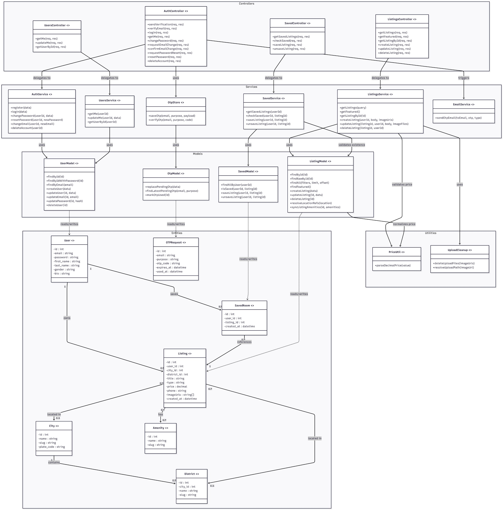
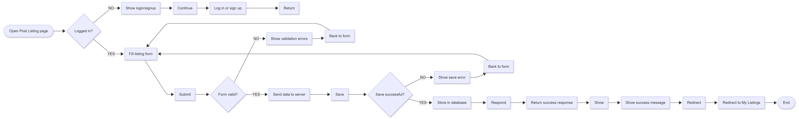
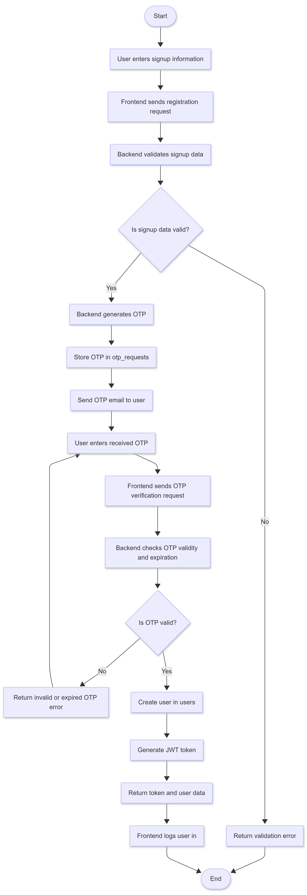
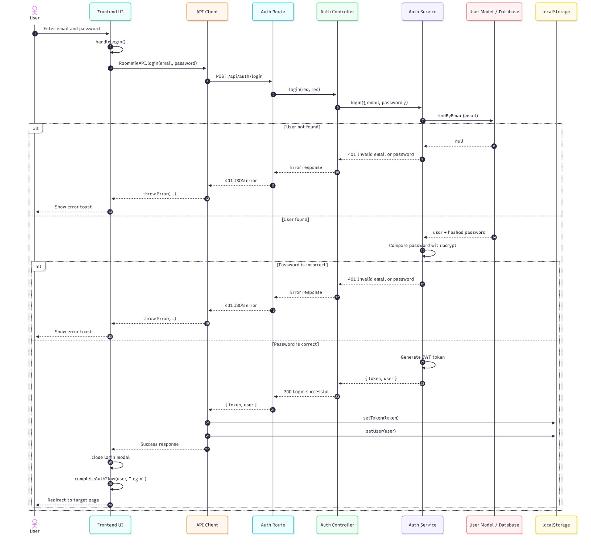
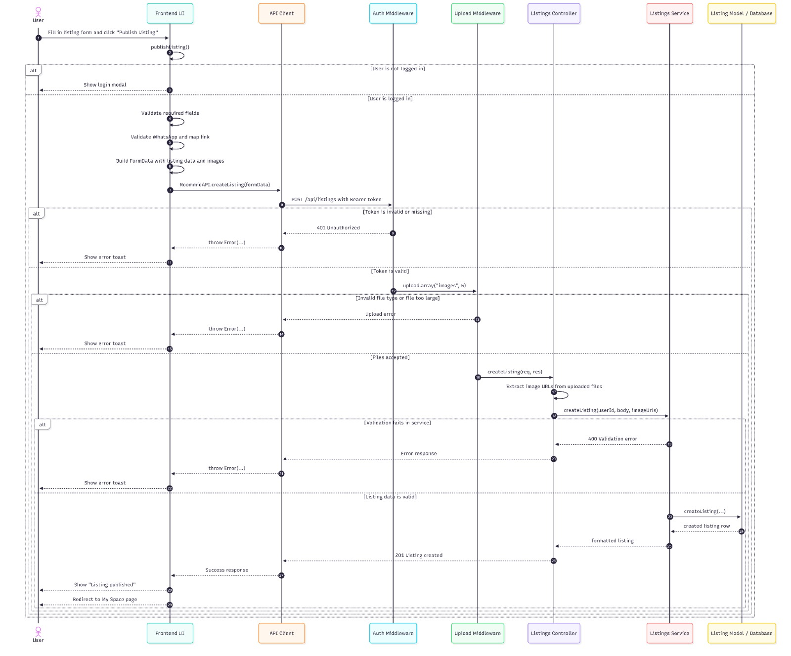
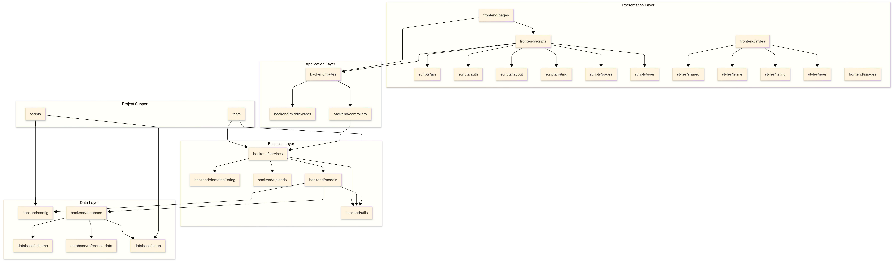

## Roommie – Student Housing Finder Platform

## 1. Scope

The Roommate Rental System is a web-based application designed to help users find suitable roommates and rental options in an organized way. Users can create accounts, post and manage listings, browse available rooms, and connect with others looking for shared housing.

The project focuses on core features such as user registration, listing management, and search functionality. Communication between users is handled through external platforms like WhatsApp rather than an internal chat system.

Advanced features such as online payments, identity verification, and integration with external services are out of scope for this project, as the goal is to keep the system simple and focused.

## 2. References
- https://www.cs.ubc.ca/~gregor/teaching/papers/4+1view-architecture.pdf
- https://www.geeksforgeeks.org/system-design/package-diagram-introduction-elements-use-cases-and-benefits/
- https://en.wikipedia.org/wiki/4%2B1_architectural_view_model

## 3. Software Architecture
The system is designed using a layered structure that separates the user interface, application logic, and data storage. This makes the application easier to organize, develop, and maintain.

It includes:
- Frontend: The part users interact with (login, listings, search)
- Backend: Handles system logic and manages users and listings
- Database: Stores user and listing data

This approach keeps the system simple while still allowing future improvements.

## 4. Architectural Goals & Constraints

### Goals
- Provide a clear and easy-to-use interface
- Help users quickly find suitable listings
- Allow simple management of listings
- Keep the system organized and maintainable
- Ensure good performance

### Constraints
- Web-based application only
- Limited time and resources (course project)
- No internal messaging system (external apps are used)
- No integration with payment systems or external APIs
- Focus on core features only (listings, search, profiles)

## 5. Logical Architecture
The logical architecture describes the main functional components of Roommie and how responsibilities are distributed between them. It focuses on major abstractions rather than implementation details.

Roommie follows a layered architecture with MVC-style separation in the backend.

The main logical components are:

### User Management

Handles:
- account registration
- login
- password change
- password reset
- email change
- account deletion
- profile update and retrieval

This component manages user identity and account state.

### OTP Verification System

Handles:
- OTP generation
- OTP storage
- OTP verification
- OTP expiration
- one-time usage of verification codes

OTP is used for:
- account registration
- password reset
- email change confirmation

Unverified users are not stored in the `users` table until OTP verification succeeds.

### Listing Management

Handles:
- creating listings
- editing listings
- deleting listings
- retrieving listing details
- associating listings with a user
- validating contact and room information

Listing data includes room type, description, location, price, preferences, images, and contact information.

### Search and Filtering

Handles:
- browsing listings
- searching by title or location
- filtering by city, district, room type, amenities, maximum price, roommate count, gender preference, smoking preference, pets, and environment

This component supports efficient discovery of suitable rooms.

### Saved Rooms Management

Handles:
- saving listings
- unsaving listings
- retrieving saved listings
- preventing duplicate saved entries

### Reference Data Management

Handles system-wide lookup data such as:
- cities
- districts
- amenities

This ensures consistency across listing creation, filtering, and display.

### Image Management

Handles:
- receiving uploaded images
- storing them on the server filesystem
- linking image paths to listings
- deleting removed or replaced files

### Persistence Layer

Stores all structured system data in MySQL using normalized tables:
- users
- listings
- listing_images
- saved_rooms
- otp_requests
- cities
- districts
- amenities
- listing_amenities

The logical architecture supports separation of concerns and reduces duplication between components.

The layered class diagram is placed in this section because it shows the main logical components of the system and the relationships between controllers, services, models, entities, and supporting utilities.

## Layered Class Diagram
The following layered class diagram presents the main structural elements of Roommie and the relationships between controllers, services, models, entities, and utility components. It shows how responsibilities are separated across the backend architecture and how the major system components interact.

The diagram reflects Roommie’s layered design. Controllers handle HTTP requests, services contain business logic, models manage database access, entities represent the main stored data objects, and utilities provide shared support functions such as price parsing and upload cleanup.

## 6. Process Architecture

### Activity Diagrams

An activity diagram shows the step-by-step flow of actions in a system process. It helps illustrate how a task starts, what decisions are made during execution, and how the process ends. Here are two examples of activity diagrams in Roommie: Post Listing and User Registration with OTP.

#### Post Listing Activity Diagram

This activity diagram shows the process of creating a new listing. It includes checking whether the user is logged in, filling and validating the form, sending the data to the backend, saving the listing, and showing a success response.

#### User Registration with OTP Activity Diagram

This activity diagram shows the process of registering a new user account with email verification. It includes signup validation, OTP generation, email sending, OTP verification, and final account creation.

## Login Sequence Diagram

This sequence diagram shows the login flow of the Roommie website. The process starts when the user enters their email and password in the login modal and clicks the Log In button. The frontend handles this action through the login form and calls RoommieAPI.login(email, password) from the API client. Then, the API client sends a POST /api/auth/login request to the backend authentication route.

On the backend, the authentication route forwards the request to the authentication controller, which passes the email and password to the authentication service. The service searches for the user in the user model/database by using the submitted email address. If no user is found, the system returns an error response such as “Invalid email or password”, and the frontend displays this message as a toast notification.

If the user exists, the authentication service compares the entered password with the stored hashed password using bcrypt. If the password is incorrect, the backend again returns a 401 error, and the frontend shows an error toast. If the password is correct, the backend generates a JWT token and returns the token together with the user information.

After a successful login, the API client stores the token and user data in localStorage as roommie_token and roommie_user. The frontend then closes the login modal, updates the authenticated user interface, and redirects the user to the appropriate Roommie page, such as the browse page or the previously requested protected page.

## Post Listing Sequence Diagram

This sequence diagram shows how a logged-in Roommie user publishes a new room listing. The process starts when the user fills in the listing form with details such as title, room type, city, district, description, price, phone number, WhatsApp information, map location, amenities, roommate preferences, and room images. When the user clicks Publish Listing, the frontend runs publishListing().

First, the frontend checks whether the user is logged in by using the stored authentication data. If the user is not logged in, Roommie displays the login modal and stops the publishing process. If the user is logged in, the frontend validates the required fields, normalizes the WhatsApp and map location values, and builds a FormData object that contains both the listing details and uploaded image files.

The API client then calls RoommieAPI.createListing(formData) and sends a POST /api/listings request with a Bearer token in the Authorization header. On the backend, the authentication middleware checks whether the token is missing, invalid, or expired. If the token is not valid, the server returns an unauthorized error, and the frontend shows an error toast.

If the token is valid, the upload middleware processes the uploaded room images. If an uploaded file is invalid or too large, the server returns an upload error, and the frontend displays the error. If the files are accepted, the request continues to the listings controller. The controller extracts the listing data and image URLs, then sends them to the listings service.

The listings service validates the listing data. If the listing information is missing or invalid, it returns a validation error. If the listing data is valid, the service creates a new listing record in the database through the listing model. After the database confirms that the listing has been created, the backend returns a success response. Finally, the frontend shows a “Listing published” message and redirects the user to the My Space page.

## Use-Case Diagram

This use case diagram represents the Roommie platform and shows how users interact with the system. There are four main actors: **Guest**, **Student** (logged-in user), **Homeowner** (listing owner), and an external **WhatsApp System**. Each actor has different permissions based on their role.

### Guest
Guests can explore the platform without logging in:
- Browse listings, search, and apply filters  
- View featured listings  
- Register an account or log in to access more features  

### Student
Once logged in, users act as students and gain additional capabilities:
- View detailed listing information  
- Save/unsave listings and view saved listings  
- Contact homeowners via WhatsApp  
- Manage their account (update profile, change password, delete account)  

### Homeowner
Homeowners are responsible for managing listings:
- Create new listings  
- Update existing listings  
- Delete listings  
- View listing details and communicate via WhatsApp  

### System Features
- Authentication and security processes (password reset, email change)  
- OTP-based verification (**Send OTP** and **Verify OTP**) for sensitive actions  
- Core features like browsing, searching, and viewing listings  
- WhatsApp integration for direct communication between users  

 The system follows a marketplace model where guests explore, students search and interact, and homeowners manage listings, supported by secure authentication and communication tools.

## 7. Development Architecture

The development architecture of the Roommie system follows a layered structure consisting of Presentation, Application, Business, and Data layers. Each layer is responsible for a specific concern and interacts only with adjacent layers to maintain low coupling and high cohesion. The diagram below illustrates the organization of modules and their dependencies within the system.

### Package Diagram

The Presentation Layer contains the frontend components responsible for user interaction, including pages, scripts, styles, and images. The scripts module handles client-side logic and communicates with the backend through API calls.

The Application Layer includes routes, controllers, and middlewares. Routes define the system endpoints, middlewares handle request validation and authentication, and controllers coordinate incoming requests by invoking the appropriate business logic.

The Business Layer contains the core logic of the system. The services module implements application-level operations such as email and OTP handling, while the listing domain module encapsulates listing-related functionality. Supporting components such as uploads and utilities provide reusable functionality.

The Data Layer is responsible for data management and persistence. Models define the structure of the system entities, config manages environment and database connections, and the database module contains schema definitions and setup logic.

Additionally, the Project Support components such as scripts and tests assist in development and testing but are not part of the runtime system.

Dependencies follow a top-down flow from the Presentation Layer to the Data Layer. Each layer depends only on the layer directly below it, ensuring a clean separation of concerns and improving maintainability, scalability, and testability of the system.

## 8. Physical Architecture

The Physical Architecture section was omitted because Roommie uses a simple single-server deployment and does not involve complex infrastructure or distributed components. For this project, the software and process views already describe the runtime environment sufficiently, so a separate physical view would add little new insight.

## 9. Scenarios

### Scenario 1: User Registration with OTP
User enters signup information.
Frontend sends registration request.
Backend generates OTP and stores it in otp_requests.
Backend sends OTP email.
User submits the OTP.
Backend verifies the OTP.
User account is created in users.
JWT token is returned.

This validates:
authentication
OTP subsystem
email service
persistence

### Scenario 2: Profile Update
Authenticated user opens the profile page.
Frontend requests the current user profile.
Backend validates the JWT token.
Backend retrieves the user from the database.
Frontend fills the profile form with stored data.
User edits profile fields such as name, gender, or bio.
Frontend sends the updated profile data to the backend.
Backend validates and saves the updated fields.
Updated profile data is returned and shown in the UI.

This validates:
user management
protected routes
profile retrieval and update
persistence consistency

### Scenario 3: Room Request
User browses available listings.
User opens a listing they are interested in.
Frontend displays room details, preferences, and poster contact information.
User decides to reserve or request the room.
Instead of an internal booking system, the platform directs the user to contact the poster through WhatsApp or the provided contact method.
User sends a message expressing interest in the room.
Poster reviews the request externally and decides whether the room is still available.
If both sides agree, the reservation is handled outside the platform.
The listing may later be removed or updated by the poster if the room is no longer available.

This validates:
listing retrieval
poster profile and contact flow
simple user decision flow
system scope constraint with no internal reservation module

### Scenario 4: Browse and Filter Listings
User opens browse page.
User selects filters and enters search text.
Frontend sends filter parameters to backend.
Backend returns matching listings with pagination.
Frontend renders cards and navigation controls.
This validates:

search and filtering
listing retrieval
frontend-backend interaction

### Scenario 5 : Posting a Listing
Authenticated user opens the post listing page.
Frontend loads reference data such as cities, districts, and amenities.
User enters room details, price, preferences, description, and contact information.
User selects one or more images for the listing.
Frontend validates required fields before submission.
Frontend sends the listing data and images to the backend.
Backend verifies the JWT token and confirms the user is authenticated.
Backend validates and normalizes the listing data.
Upload middleware stores image files in the uploads folder.
Backend inserts the listing into listings.
Backend inserts related image records into listing_images.
Backend inserts selected amenities into listing_amenities.
Backend returns the created listing response.
Frontend shows success feedback and the listing becomes visible in browse results.
This validates:

authentication
listing management
image management
reference data usage
persistence consistency 

## 10. Size and Performance

Roommie is designed for a small-to-medium academic project scale. The system is expected to support a moderate number of users and listings while remaining simple, maintainable, and efficient.

### Expected Size
- moderate number of registered users
- moderate number of active listings
- small reference datasets for cities, districts, and amenities
- limited number of images per listing

### Performance Characteristics
- listing search and filtering are handled through structured backend queries
- pagination reduces the amount of data loaded at one time
- normalized reference tables reduce redundancy and improve consistency
- images are stored in the filesystem instead of the database to keep database queries lighter
- OTP operations are lightweight and short-lived

### Limitations
- no caching layer
- no load balancing
- no distributed file storage
- no asynchronous job queue
- single-server assumptions

These tradeoffs are acceptable for the current project scope.

## 11. Quality

### Maintainability

The system uses a layered backend and grouped frontend modules, which makes responsibilities clearer and reduces duplication.

### Modifiability

New filters, profile fields, and listing features can be added with limited impact on unrelated modules.

### Usability

The system provides direct page-based flows for:
- signup
- login
- browse
- post listing
- edit listing
- save listing
- manage profile

### Security

Security mechanisms include:
- password hashing with bcrypt
- JWT-based authentication
- OTP verification for sensitive flows
- route protection for authenticated actions
- server-side validation
- parameterized SQL queries

### Reliability

The system uses structured validation, normalized persistence, image cleanup logic, and automated tests for important service flows.

### Simplicity

The architecture avoids unnecessary systems such as chat, payments, and advanced external integration, keeping the design suitable for a student project.

## 12. Appendices

### Acronyms and Abbreviations
- OTP: One-Time Password
- JWT: JSON Web Token
- MVC: Model-View-Controller
- API: Application Programming Interface
- SMTP: Simple Mail Transfer Protocol
- DB: Database

### Definitions
- Listing: A room advertisement posted by a user
- Poster: The user who created a listing
- Saved Room: A listing bookmarked by a user
- Reference Data: Shared lookup data such as cities, districts, and amenities
- OTP Request: A temporary verification record used during signup, password reset, or email change
- Authentication: The process of verifying the identity of a user
- Authorization: The process of checking whether a user has permission to perform an action

### Design Principles
- Separation of Concerns
- Layered Architecture
- Single Responsibility Principle
- Low Coupling
- High Cohesion
- Normalized Data Design
- Simplicity over unnecessary complexity

